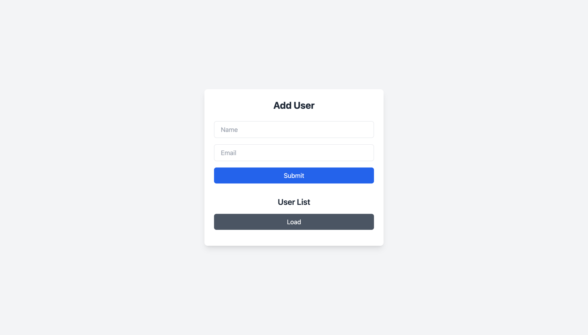
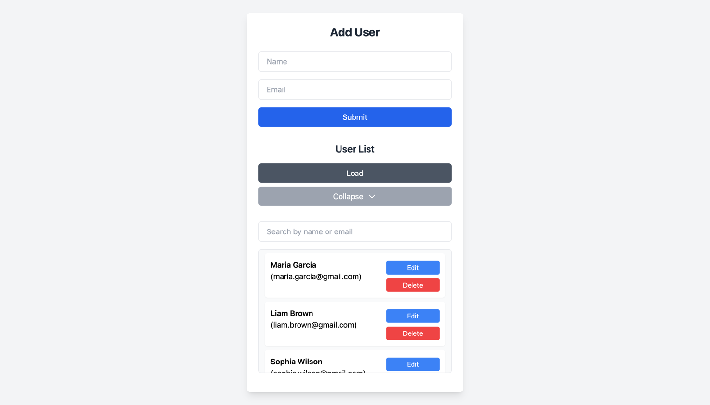
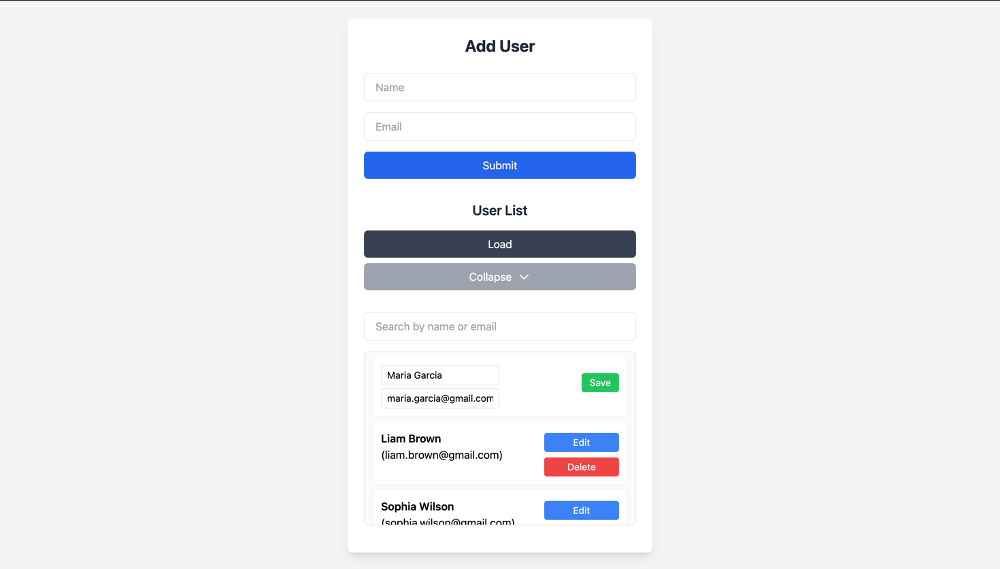

# db-cli-docker - CLI Web Application for User Management

Welcome to the `db-cli-docker` project! This is a web application built with Go using the `http` package for user management, containerized with Docker. The project was created to explore Go, HTTP, and Docker technologies.

## Overview
This application allows you to:
- Add new users.
- View a list of users.
- Update user details.
- Delete users.
  Data is stored in a PostgreSQL database running within a Docker container.

---
## Installation

### Prerequisites
- Docker and Docker Compose (installed on your machine).
- Go 1.22 (for building the backend).

### Installation Steps
1. Clone the repository:
```bash
git clone https://github.com/AMJIETIK/db-cli-docker.git
cd db-cli-docker
```

2. Create a .env file in root and backend directory with the following environment variables:

root:
```env
POSTGRES_USER=your_name
POSTGRES_PASSWORD=your_pass
POSTGRES_DB=your_db
```

backend:
```env
DATABASE_URL=postgres://your_name:your_pass@db:5432/db
```
_(Replace your ... with your data.)_

P.S. - Database Backup
A backup file (backup.sql) is included in this repository. You can use it to populate the PostgreSQL database with sample data for testing. To load the backup
write this stroke into your terminal or exec it into docker container:

```bash
psql -U username -d dbname -f backup.sql
```
**(Don't forget to replace username and dbname with your data)**

3. Build and run the project using Docker Compose:
```bash
docker-compose up --build
```

4. Open your browser and navigate to http://localhost:8080.

---
## Usage

### Interface

After launching the application, open http://localhost:8080 in your browser. You’ll see a simple interface with options to:
- Add a user via a form.
- Load and view the user list.
- Edit or delete existing users.

### Example Requests

- **Add a User** (POST):

```bash
curl -X POST -H "Content-Type: application/json" -d '{"name":"John","email":"john@example.com"}' http://localhost:8080/users
```

- **Get User List** (GET):
```bash
curl http://localhost:8080/users/list
```

### Screenshots

Here’s how the application looks in action:

- **Homepage with Add User Form**: 
- **User List View**: 
- **Editing a User**: 
